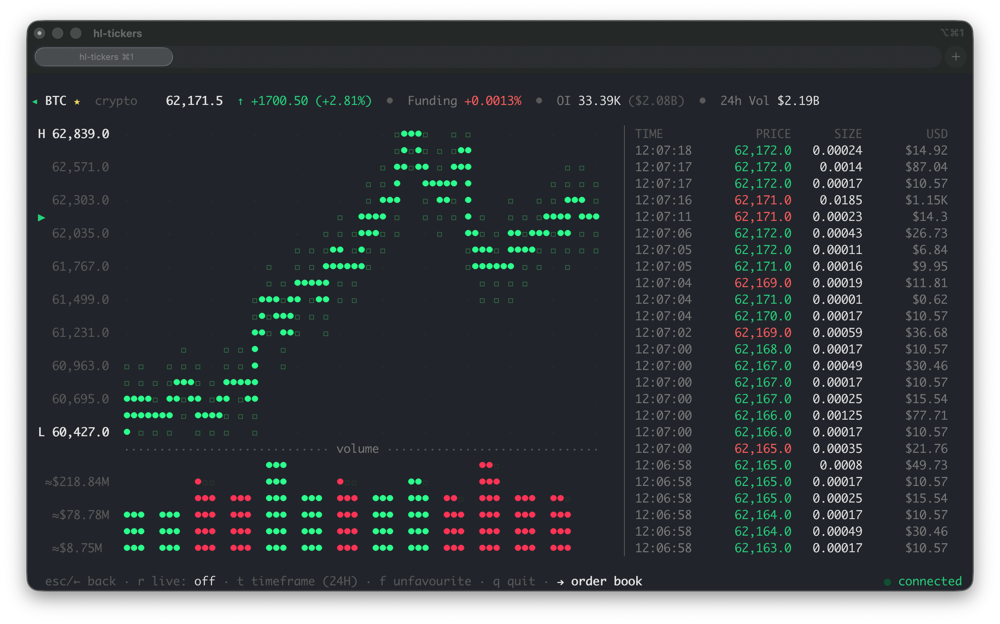
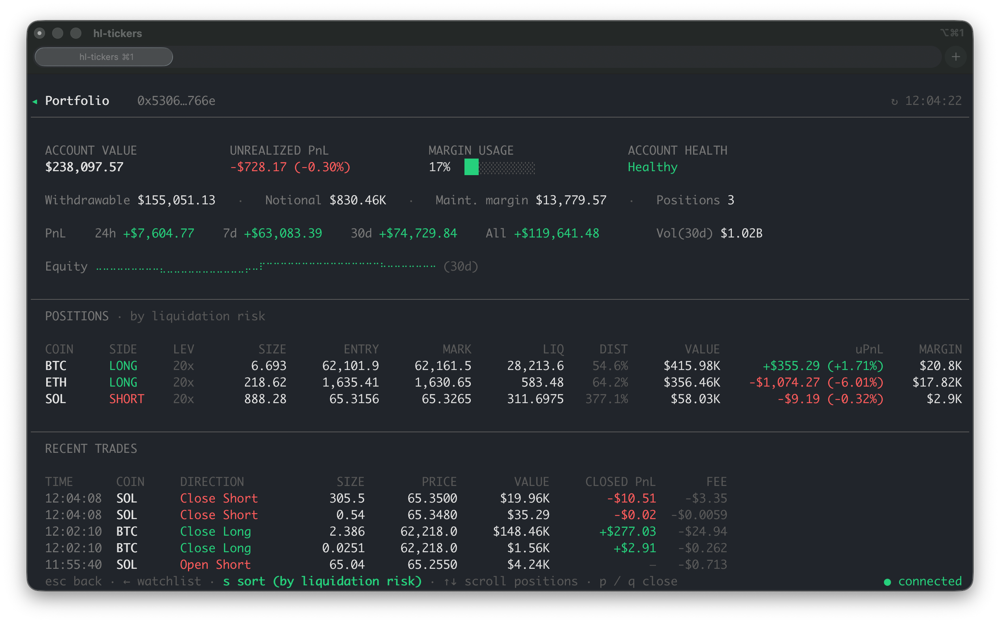

<p>
<a href="https://goreportcard.com/badge/github.com/brayden967/hl-tickers"></a>
</p>
<h1>hl-tickers</h1>

Lightweight TUI market watcher with 400+ markets supported across forex, equities, crypto, and indices. **No accounts, no API keys, free to use**
<p align="center">

</p>


## Features

Inspired by [`achannarasappa/ticker`](https://github.com/achannarasappa/ticker) & [`Tucsky/aggr`](https://github.com/Tucsky/aggr).

- **One source.** View 400+ markets (forex, equities, indexes, and crypto) - no juggling data sources
- **Realtime by default.** Websocket stream for live price & OHLC data
- **Detailed Asset View** Press `Enter` on any market for a full-screen view with
  price chart 
- **Discovery-first.** Press `/` to explore 400+ assets & indexes
- **Positions & PnL (optional)** Paste a public `0x` address track live positions
- **Fast cold start.** First load caches all available markets (1-2s) subsequent starts are instant

## Install / build

### Mac & Linux: Homebrew (recommended)

```sh
brew install brayden967/tap/hl-tickers
```

Usage:
```sh
hl-tickers                     
hl-tickers --add BTC,GOLD,SPX   # preload favorites
```

### Cross Platform: Build from source
Requires **Go 1.24.2+** (latest stable recommended)

```sh
git clone https://github.com/Brayden967/hl-tickers.git && cd hl-tickers
go build -o hl-tickers .
./hl-tickers
```
**On Windows run `./hl-tickers.exe`**

### Alternative: Install binary with Go

```sh
go install github.com/brayden967/hl-tickers@latest
hl-tickers
```

Set a wallet (for live perp positions) via the in-app `w` key, or the `wallet:` field in the config file.

### Keys

| Key | Action |
|-----|--------|
| `/` | Search all markets (crypto / equities / commodities) |
| `↑ ↓` / `j k` | Move selection |
| `shift+↑ ↓` / `K J` | Reorder the selected favourite (persists) |
| `enter` | Open the asset explorer (chart + live trades) for the selected row |
| `enter` (in search) | Add + favourite the highlighted asset |
| `p` | Open the portfolio viewer (if address is added) |
| `f` | Favourite / unfavourite the selected row |
| `d` / `x` | Remove the selected row |
| `w` | Add / change wallet address (live positions) |
| `s` | Cycle sort: manual → change% → alpha |
| `F` `V` `R` `S` | Toggle funding+OI · volume · 24h range · trend chart |
| `q` / `esc` / `ctrl+c` | Quit |

In the selected asset view: `t` cycles the chart timeframe, `f` favourites, `r` enables realtime chart and `esc` returns.

### Portfolio View



### Symbols

1. **Crypto perps** — bare names (`BTC`, `ETH`, `kPEPE`).
2. **HIP-3 builder perps** — `dex:SYM` (`xyz:GOLD`, `xyz:SP500`). Displayed by
   their short symbol with a kind tag.
3. **Aliases** — names mapped to coins: `OIL→xyz:CL`, `SPX→xyz:SP500`,
   `GOLD→xyz:GOLD`, `PEPE→kPEPE`, …

## Configuration

State is written to `~/.config/hl-tickers/config.yaml`. No database

```yaml
wallet: "0x…"            # optional public address
favourites:              # starred coins, in display order
  - BTC
  - ETH
  - xyz:GOLD
show_funding: false
show_volume: false
show_range: false
show_spark: true
show_summary: true
```

## License

MIT

Attribution to this repo is appreciated.
